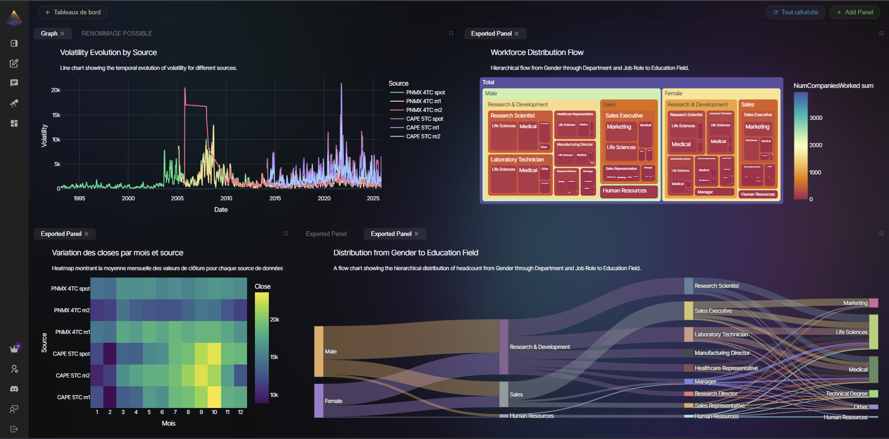
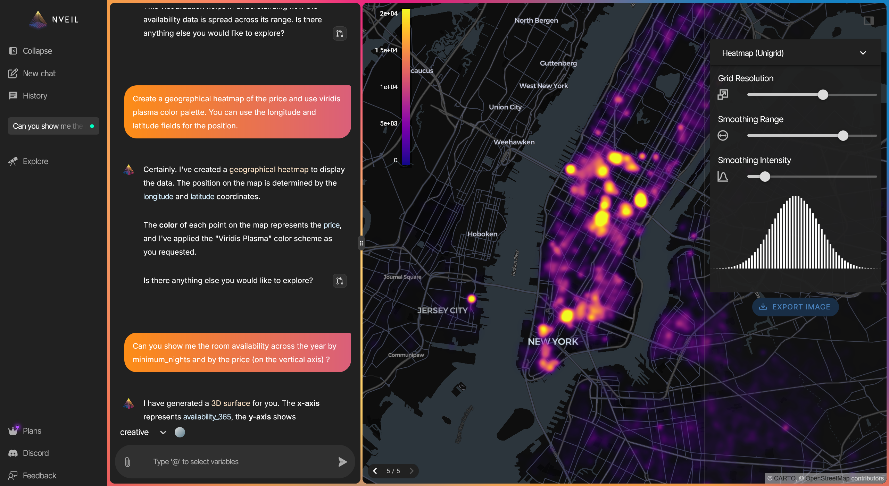

<p align="center">
  
</p>

<h1 align="center">NVEIL Python SDK</h1>

<p align="center">
  <strong>Describe your data. Get production charts. Your data stays local.</strong>
</p>

<p align="center">
  <a href="https://pypi.org/project/nveil/"></a>
  <a href="https://pypi.org/project/nveil/"></a>
  <a href="https://docs.nveil.com"></a>
  <a href="LICENSE"></a>
</p>

<p align="center">
  <a href="https://docs.nveil.com/getting-started/quickstart/">Quickstart</a> &bull;
  <a href="https://docs.nveil.com/api-reference/">API Reference</a> &bull;
  <a href="https://docs.nveil.com/examples/">Examples</a> &bull;
  <a href="https://docs.nveil.com/changelog/">Changelog</a>
</p>

---

NVEIL is an AI-powered data visualization SDK. Write one line of natural language, and NVEIL processes your data and generates publication-ready visualizations — no chart code, no hallucinations, no data leaving your machine.

```python
import nveil
import pandas as pd

nveil.configure(api_key="nveil_...")

df = pd.read_csv("sales.csv")
spec = nveil.generate_spec("Revenue by region, colored by quarter", df)

fig = spec.render(df)       # 100% local — no API call
nveil.show(fig)              # opens in browser
```

<p align="center">
  
</p>

## Why NVEIL?

| Feature | NVEIL | Plotly / Matplotlib | ChatGPT / Copilot |
|---------|:-----:|:-------------------:|:------------------:|
| Natural language input | :white_check_mark: | :x: | :white_check_mark: |
| Deterministic output | :white_check_mark: | N/A | :x: |
| Data stays local | :white_check_mark: | :white_check_mark: | :x: |
| Offline rendering | :white_check_mark: | :white_check_mark: | :x: |
| 50+ viz types (2D, 3D, geo, medical) | :white_check_mark: | Manual | Unreliable |
| Reusable specs | :white_check_mark: | :x: | :x: |
| Data processing engine | :white_check_mark: | :x: | :x: |

## How It Works

```
Your Data ──> SDK ──metadata only──> NVEIL AI ──> Processing Plan ──> Local Execution ──> Result
               ^                                                           ^
          raw data stays here                                     raw data stays here
```

1. **You describe** what you want in plain language
2. **NVEIL AI plans** the data processing and visualization (only metadata is sent — column names, types, statistics)
3. **The SDK executes locally** — joins, aggregations, pivots, rendering — all on your machine
4. **You get a figure** — Plotly, VTK, or DeckGL, auto-selected for your data

## Key Features

<table>
<tr>
<td width="50%">

### :brain: Two Engines in One
Data processing (joins, pivots, aggregations, geocoding, time series) **AND** visualization generation from a single prompt.

### :lock: Data Privacy by Design
Raw data never leaves your machine. Only column names, types, and aggregate statistics are sent.

### :chart_with_upwards_trend: Multi-Backend Rendering
Auto-detects the best engine: **Plotly** (2D charts), **VTK** (3D/medical), **DeckGL** (geospatial).

</td>
<td width="50%">

### :test_tube: Auditable Results
Powered by constraint solving, not random generation. Same input = same output, every time.

### :zap: Offline Rendering
`spec.render()` runs 100% locally with zero API calls.

### :floppy_disk: Reusable Specs
Save to `.nveil` files, reload later, render on new data — no server needed.

</td>
</tr>
</table>

## Beyond Simple Charts

<p align="center">
  
</p>

NVEIL handles geospatial heatmaps, 3D volumes, scientific visualizations, medical imaging (DICOM), network graphs, and 50+ other visualization types — all from natural language.

## Save Once, Render Forever

```python
# Generate once (API call)
spec = nveil.generate_spec("Monthly trend by category", df)
spec.save("trend.nveil")

# Reload anywhere — no API call, no server, no cost
spec = nveil.load_spec("trend.nveil")
fig = spec.render(fresh_data)
nveil.save_image(fig, "report.png")
```

## Installation

```bash
pip install nveil
```

**Requirements:** Python 3.10+

## Getting Started

1. Create an account at [app.nveil.com](https://app.nveil.com)
2. Generate an API key in **Settings**
3. Start visualizing

```python
import os
import nveil

nveil.configure(api_key=os.environ["NVEIL_API_KEY"])

spec = nveil.generate_spec("scatter plot of price vs area", df)
fig = spec.render(df)
nveil.show(fig)
```

See the [examples/](examples/) directory for more usage patterns.

## Documentation

Full documentation is available at **[docs.nveil.com](https://docs.nveil.com)**:

- [Quickstart Guide](https://docs.nveil.com/getting-started/quickstart/)
- [Core Concepts](https://docs.nveil.com/concepts/) — sessions, specs, and the two-stage flow
- [API Reference](https://docs.nveil.com/api-reference/) — full reference for all public functions
- [Privacy Model](https://docs.nveil.com/concepts/privacy-model/) — what data is sent, what stays local
- [Examples](https://docs.nveil.com/examples/) — bar charts, multi-dataset, offline rendering

## Contributing

NVEIL is proprietary software. Bug reports and feature requests are welcome via [GitHub Issues](https://github.com/nveil-ai/nveil-sdk/issues).

## License

Proprietary. See [LICENSE](LICENSE) for details.

---

<p align="center">
  <a href="https://nveil.com">Website</a> &bull;
  <a href="https://docs.nveil.com">Documentation</a> &bull;
  <a href="https://app.nveil.com">Platform</a>
</p>
